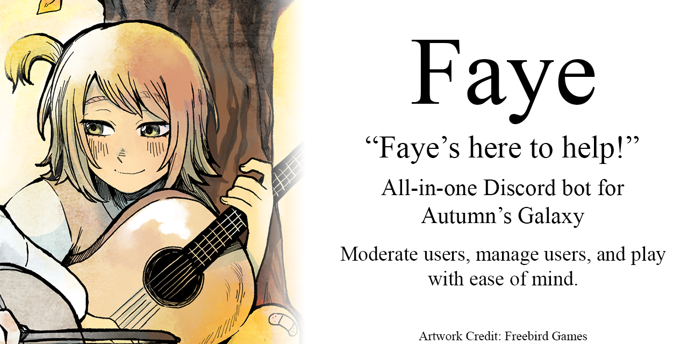

---

---

## Who/What is Faye?
Faye is a Discord bot made for [Autumn's Galaxy](https://discord.gg/2w9VTE7) that's designed as a personal assistant to the members and moderators! Faye is an all-in-one Discord bot that can do anything from creating role menus, to timing out users, to playing a game of Wordle in Discord! And the best part? Its creator doesn't support NFTs!

## How do I set up Faye?
After changing role IDs and such in the `/config` folder, you should be able to just run `npm start`/`yarn start` and get going!

## Does Faye require a database?
At time of writing, Faye uses [NeDB](https://github.com/louischatriot/nedb) for its Wordle feature. However, it's kept in the memory, so there's no database file required.

## Can I invite Faye to my server?
Unfortunately, no. Faye is built from the ground up to only be used with one specific server. However, the code is here, so you can edit the code to your liking and host your own instance of Faye!

## Is Faye hard to host?
Nope, in fact, Faye has files making it all ready to go with Heroku! You can deploy it instantly!

---

## Setup Requirements

* [Discord.js](https://discord.js.org/) v13+, older versions will *not* work.
* Node.JS v16+, older versions have not been tested

After you've got all that, just run `yarn`/`npm isntall`!